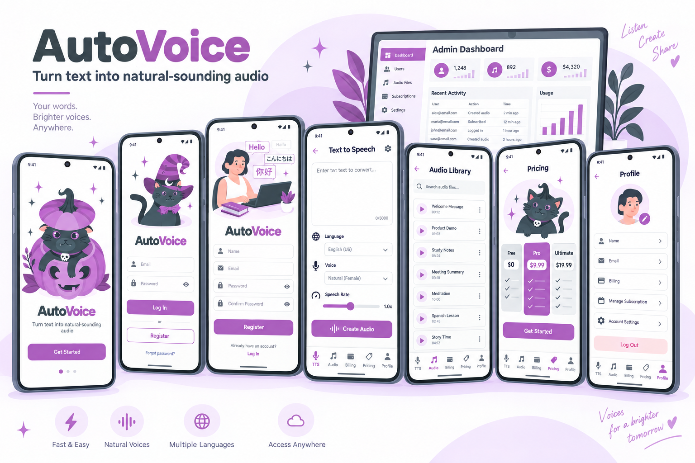
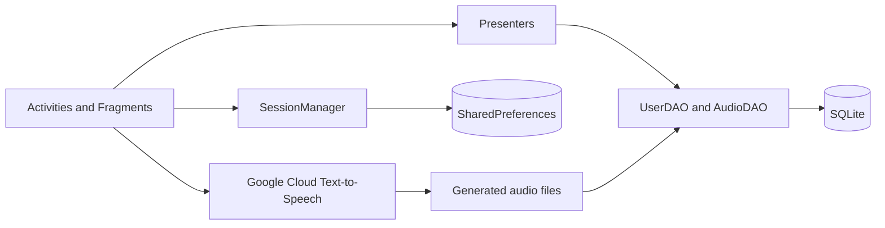

<div align="center">

# AutoVoice

### Turn text into natural-sounding audio

An Android text-to-speech application with multilingual voice generation, local audio management, account administration, and subscription-oriented user experiences.


</div>



> The image above is a conceptual product showcase created from the layouts, color system, and illustration assets in this repository. It is not an emulator screenshot; final rendering can vary by device and Android version.

## Overview

AutoVoice converts written content into downloadable speech through Google Cloud Text-to-Speech. The application combines an approachable Material Design interface with configurable speech controls, a local audio library, user profiles, pricing and billing views, and a dedicated administration experience.

The project is implemented as a native Android application in Java. It uses Activities and Fragments for presentation, presenter classes for interaction logic, SQLite DAOs for local persistence, and SharedPreferences for session state.

## Key Features

- Generate natural-sounding audio from text with Google Cloud Text-to-Speech.
- Select a language, voice type, voice name, and speech rate.
- Preview generated audio and download it for offline use.
- Browse locally generated files with playback and download controls.
- Register and sign in with email credentials or Google Sign-In.
- Protect local passwords with BCrypt hashing.
- View profile, billing information, subscription status, and pricing plans.
- Change passwords and maintain a local authenticated session.
- Manage users, roles, passwords, and subscription packages from the admin dashboard.
- Support Android 7.0 (API 24) and later.

## Interface Coverage

| Experience | Purpose |
| --- | --- |
| Splash and onboarding | Introduces AutoVoice and guides users into the application. |
| Login | Supports email/password and Google account authentication. |
| Registration | Creates a local account with validated credentials. |
| Text-to-Speech workspace | Accepts text and exposes language, voice, and speech-rate controls. |
| Audio library | Lists generated audio with playback and download actions. |
| Pricing | Presents Personal, Commercial, Corporate, and pay-as-you-go options. |
| Billing | Displays account, subscription, balance, and payment-history information. |
| Profile | Shows user identity and provides password and logout actions. |
| Change password | Verifies and updates a user's password securely. |
| Admin dashboard | Manages users, roles, passwords, and subscription packages. |

## Architecture



### Main Components

- **Presentation:** Android Activities, Fragments, View Binding, RecyclerView/ListView, and Material Components.
- **Application logic:** Presenter classes separate screen behavior from Activities and Fragments.
- **Persistence:** `SQLiteOpenHelper` with dedicated user and audio DAOs.
- **Authentication:** Email/password accounts, BCrypt hashing, Google Sign-In, and local session storage.
- **Speech generation:** Google Cloud Text-to-Speech through gRPC and Google authentication libraries.
- **Media:** Android `MediaPlayer` for local playback and app-managed audio files for downloads.

## Technology Stack

| Category | Technology |
| --- | --- |
| Language | Java 11 source compatibility |
| UI | AndroidX, Material Components, ConstraintLayout, View Binding |
| Build | Gradle 8.10.2, Android Gradle Plugin 8.8.0 |
| Cloud speech | Google Cloud Text-to-Speech 2.13.0 |
| Authentication | Google Sign-In and Google Auth libraries |
| Local storage | SQLite and SharedPreferences |
| Password security | jBCrypt 0.4 |
| Testing | JUnit 4 and AndroidX Espresso |

## Project Structure

```text
AutoVoice/
├── app/src/main/java/com/example/autovoice/
│   ├── activities/       # Authentication, user, and admin screens
│   ├── adapters/         # User and audio list adapters
│   ├── database/         # SQLite helper and DAO classes
│   ├── fragments/        # TTS, audio, billing, pricing, and profile UI
│   ├── models/           # User, pricing, and audio entities
│   ├── network/          # Service integration placeholders
│   ├── presenters/       # Presentation and interaction logic
│   └── utils/            # Session and shared utilities
├── app/src/main/res/     # Layouts, illustrations, icons, themes, and menus
├── docs/screenshots/     # README visual assets
└── gradle/               # Version catalog and Gradle wrapper
```

## Getting Started

### Prerequisites

- Android Studio with Android SDK 35 installed.
- JDK 17 or later for the Android Gradle Plugin.
- An Android device or emulator running API 24 or later.
- A Google Cloud project with the Text-to-Speech API enabled.
- An OAuth 2.0 client configured for Google Sign-In if that login method is required.

### Installation

1. Clone the repository:

   ```bash
   git clone https://github.com/phuonglatoi/AutoVoice.git
   cd AutoVoice
   ```

2. Open the project in Android Studio and allow Gradle synchronization to finish.

3. Confirm that `local.properties` points to your Android SDK. Android Studio normally creates this file automatically.

4. Configure your own Google Sign-In client ID in `app/src/main/res/values/strings.xml`.

5. Configure Google Cloud Text-to-Speech as described in the security section below.

6. Run the `app` configuration on an emulator or a physical Android device.

### Command-Line Build

On Windows:

```powershell
.\gradlew.bat assembleDebug
```

On macOS or Linux:

```bash
./gradlew assembleDebug
```

Run local unit tests with:

```bash
./gradlew test
```

## Cloud Credentials and Security

The current prototype initializes Google Cloud Text-to-Speech from a service-account JSON resource named:

```text
app/src/main/res/raw/your_service_account_credentials.json
```

This path is excluded by `.gitignore`, and no credential is included in the repository.

> **Important:** A service-account private key must not be shipped inside a production APK. APK resources can be extracted by end users. The recommended production architecture is to call Text-to-Speech through a secured backend service, keep credentials in a server-side secret manager, authenticate app requests, and apply quotas and abuse protection.

For short-lived local evaluation of the existing prototype only, developers can supply their own credential file at the path above. Never commit it, distribute the resulting APK publicly, or reuse the credential in production. Revoke test keys when they are no longer needed.

## Development Notes

- Generated audio metadata and user records are stored locally in SQLite.
- Session information is stored in SharedPreferences.
- The repository includes starter JUnit and instrumentation test targets, but continuous integration is not configured yet.
- Pricing and billing screens currently model the user experience; production payment processing requires a verified payment provider and server-side entitlement validation.

## Recommended Next Steps

- Move Cloud Text-to-Speech calls behind an authenticated backend.
- Remove prototype/default accounts and credentials from local database initialization.
- Add repository-level continuous integration for build, lint, and tests.
- Introduce dependency injection and repository abstractions for easier testing.
- Add accessibility checks, localization resources, and automated UI tests.
- Integrate a production billing provider with server-verified subscriptions.

## Contributing

Contributions are welcome. Create a focused branch, keep changes small and documented, run the relevant tests, and open a pull request describing the motivation and validation performed.

## License

No open-source license has been specified. Unless a license is added, all rights remain with the repository owner.
